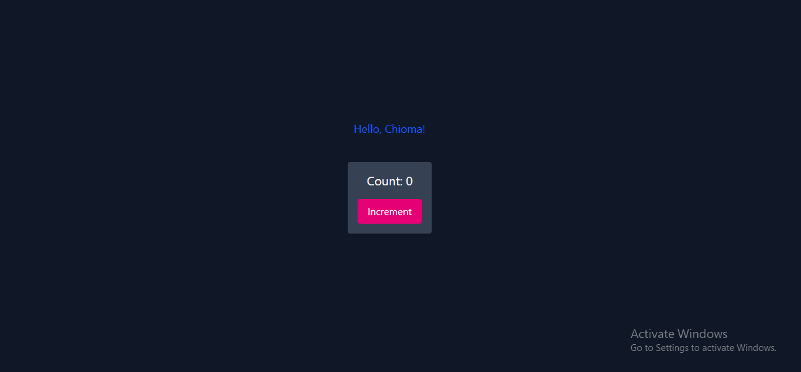

# Checkpoint Building React Apps with TypeScript

## What You're Aiming For

In this Checkpoint you will Convert the code below to Typescript.

You are asked to give description on the steps you will do to make the changes ( create a well-commented code)

### Instructions

Code 01 : 

import React from 'react'; 
const Greeting = ({ name }) => { 
return 
Hello, {name}!
;
 };
 export default Greeting;

 
Code 02 :

import React, { Component } from 'react'; 
class Counter extends Component { 
state = {
 count: 0
 }; increment = () => {
 this.setState({ count: this.state.count + 1 }); 
}; 
render() { 
return 
( 
 

Count: {this.state.count}
 
<button onClick={this.increment}>Increment</button> 

 );
 }
 } 
export default Counter

# Solution

## screenshots 
###  Code Solution
